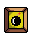

# SuperCrateBox

## [Live](https://jaredjj3.github.io/SuperCrateBox/)


SuperCrateBox is a simple but addictive game where you can collect crates, dodge enemies, and save the world! Enemies spawn faster as the game progresses, but power-ups aid you in this struggle.

## Gameplay

SuperCrateBox starts with a crate and our hero, Jay.


Jay can move left, right, and double jump. Points are awarded when Jay picks up a . Immediately after Jay picks up a , another one will spawn in a random location.

### Enemies

Enemies, called Hammers, run around the map wreaking havoc to anything they touch... Except crates. Hammers that fall through the bottom of the map reappear at the top. As you collect more crates, more Hammers spawn.


### Powerups

Jay can also pick up   

#### Shield 
After Jay picks up a , a bubble forms around him, which protects him from 1 collision with an enemy.


#### Electric Shield 
After Jay picks up a , electric rings form around him, which protects him from 1 collision with an enemy as well as removes the enemy from the game.


#### Nuke 
After Jay picks up a , up to 80% of the enemies are removed from the game! Use this wisely, since it doesn't come up as often as the other powerups.


## Implementation

SuperCrateBox is built with vanilla JavaScript and the HTML5 canvas library. The major classes in the game are `SuperCrateBox`, `Sprite`, `Input`, `CollisionManager`, and `Moveable`.

* `SuperCrateBox` manages the game's main loop, which updates all entities and renders them.

* `Sprite` manages how each entity's sprite should be rendered.

* `Input` adds event listeners that wait for user input.

* `CollisionManager` detects when an entity collides with another entity and then resets the entity appropriately.

* `Moveable` is the module that contains the logic that each moveable entity should have. Specifically, contain baseline instructions on how to construct and update the entity.

## Interesting Snippets
Collision was by far the most difficult aspect of the game to implement. In order to implement collision:

* The game's state updates the position of all entities as needed.

* The `CollisionManager` checks to see if the hitbox of one entity intersects another entity's hitbox.

* Depending on the types of the two Colliding Entities, the game is re-updated.

* The fully updated state is rendered.

For the `Player`, the game state was updated through this main switch.

```javascript
handlePlayerCollisions(player, otherObjects) {
  if (player.isDead) {
    return;
  }
  const {
    game,
    typeOfCollision,
    entityHitWall,
    isPlayerFloating,
    playerPickedUpCrate
  } = this;
  for (let i = 0; i < otherObjects.length; i++) {
    const otherObject = otherObjects[i];
    const collisionType = typeOfCollision(player, otherObject);
    if (collisionType) {
      switch(otherObject.type) {
        case 'wall':
          player.handleSurfaceCollison(collisionType);
          entityHitWall(player, collisionType);
          break;
        case 'crate':
          game.score++;
          game.resetCrate();
          break;
        case 'enemy':
          const enemy = otherObject;
          if (!enemy.isDead) {
            player.handleEnemyCollision(enemy, game);
          }
          break;
        case 'shield':
          const shield = otherObject;
          player.handlePowerupCollision('shield', game);
          game.removePowerup(shield.id);
          break;
        case 'electricShield':
          const electricShield = otherObject;
          player.handlePowerupCollision('electricShield', game);
          game.removePowerup(electricShield.id);
          break;
        case 'nuke':
          const nuke = otherObject;
          player.handlePowerupCollision('nuke', game);
          game.removePowerup(nuke.id);
          break;
        default:
          return;
      }
    }
  }
}
```
